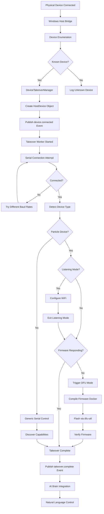
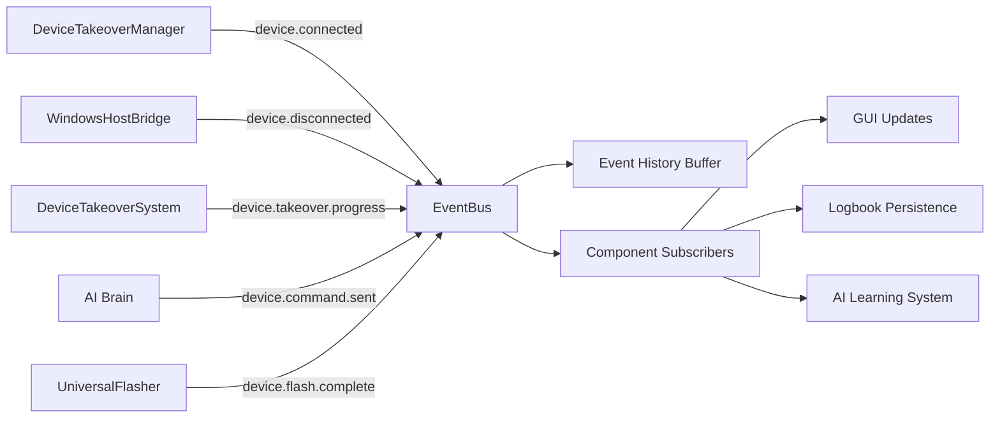
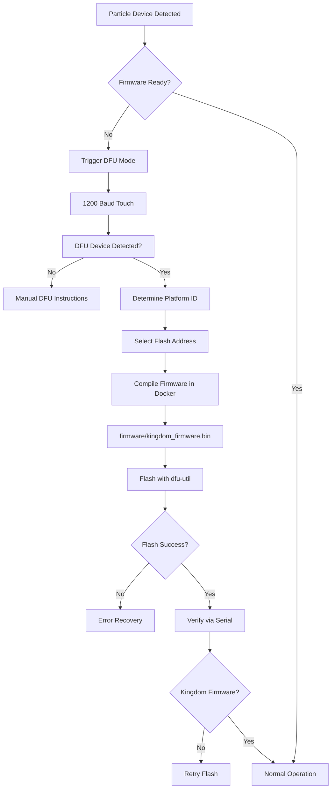
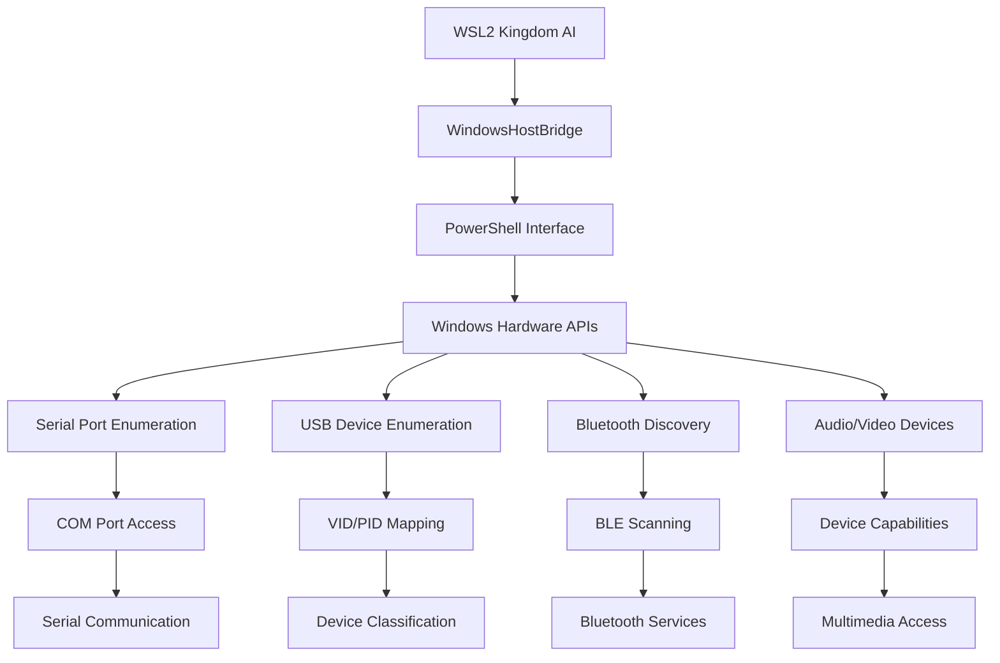
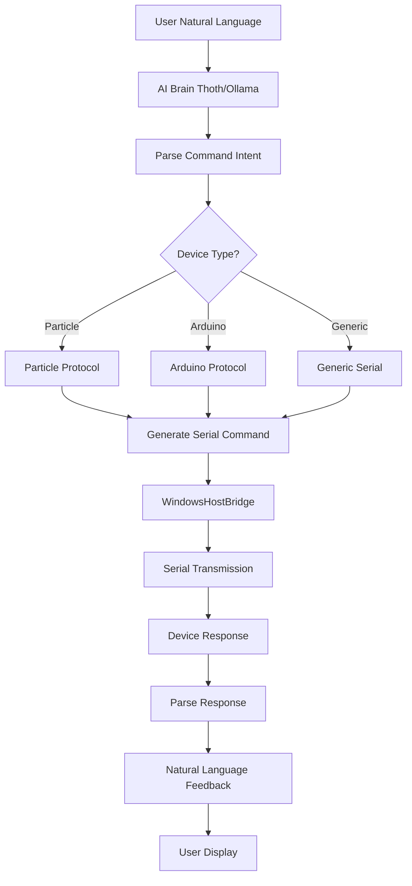
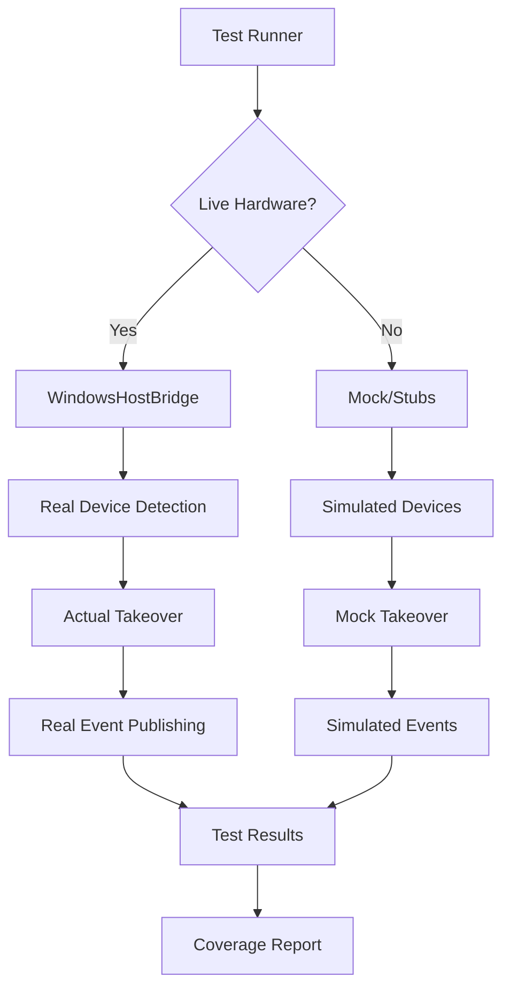
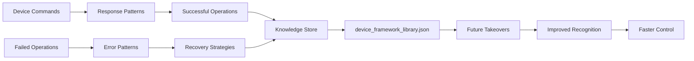
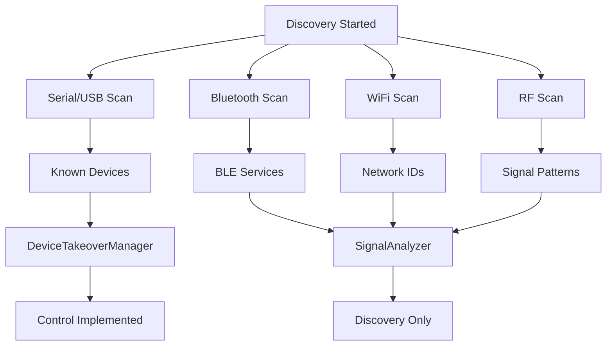

# Device Takeover Data Flow Diagrams

## 1. Serial/USB Takeover Flow (FULLY IMPLEMENTED)

## 2. Event Bus Data Flow

## 3. Particle DFU Flashing Flow

## 4. Windows Host Bridge Architecture

## 5. AI Brain Integration Flow

## 6. Test Architecture Flow

## 7. Knowledge Base Learning Flow

## 8. Multi-Protocol Discovery Flow

---

*All flows represent current implementation state as of 2026-01-21*
